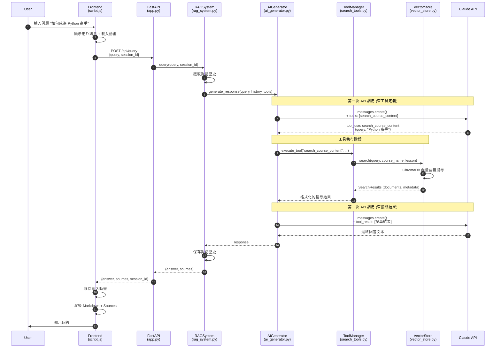
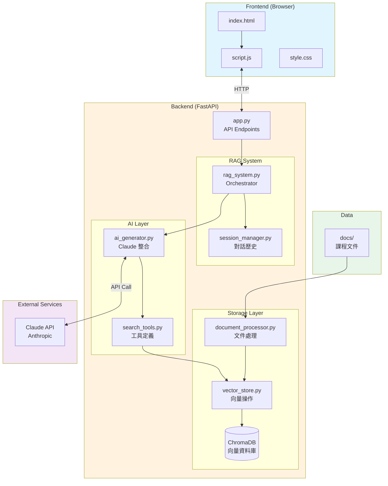
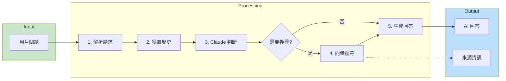
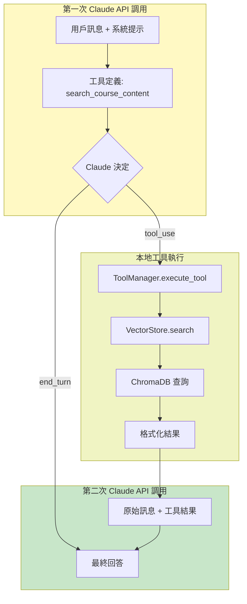

# RAG Chatbot Query Flow Diagram

## Mermaid Sequence Diagram

## Architecture Diagram

## Data Flow Diagram

## Tool Calling Flow

---

## 如何查看這些圖表

1. **GitHub**: 直接在 GitHub 上查看此文件，會自動渲染 Mermaid 圖表
2. **VS Code**: 安裝 "Markdown Preview Mermaid Support" 擴展
3. **線上工具**: 複製 Mermaid 代碼到 https://mermaid.live/
4. **Obsidian**: 原生支持 Mermaid 圖表
