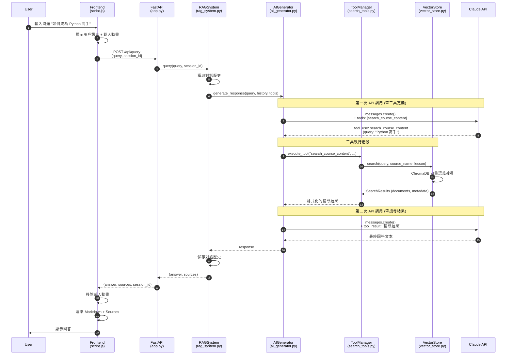

```mermaid
sequenceDiagram
    autonumber
    participant U as User
    participant FE as Frontend<br/>(script.js)
    participant API as FastAPI<br/>(app.py)
    participant RAG as RAGSystem<br/>(rag_system.py)
    participant AI as AIGenerator<br/>(ai_generator.py)
    participant TM as ToolManager<br/>(search_tools.py)
    participant VS as VectorStore<br/>(vector_store.py)
    participant Claude as Claude API

    U->>FE: 輸入問題 "如何成為 Python 高手"
    FE->>FE: 顯示用戶訊息 + 載入動畫
    FE->>API: POST /api/query<br/>{query, session_id}

    API->>RAG: query(query, session_id)
    RAG->>RAG: 獲取對話歷史
    RAG->>AI: generate_response(query, history, tools)

    Note over AI,Claude: 第一次 API 調用 (帶工具定義)
    AI->>Claude: messages.create()<br/>+ tools: [search_course_content]
    Claude-->>AI: tool_use: search_course_content<br/>{query: "Python 高手"}

    Note over AI,VS: 工具執行階段
    AI->>TM: execute_tool("search_course_content", ...)
    TM->>VS: search(query, course_name, lesson)
    VS->>VS: ChromaDB 向量語義搜尋
    VS-->>TM: SearchResults (documents, metadata)
    TM-->>AI: 格式化的搜尋結果

    Note over AI,Claude: 第二次 API 調用 (帶搜尋結果)
    AI->>Claude: messages.create()<br/>+ tool_result: [搜尋結果]
    Claude-->>AI: 最終回答文本

    AI-->>RAG: response
    RAG->>RAG: 保存對話歷史
    RAG-->>API: (answer, sources)
    API-->>FE: {answer, sources, session_id}

    FE->>FE: 移除載入動畫
    FE->>FE: 渲染 Markdown + Sources
    FE->>U: 顯示回答
```